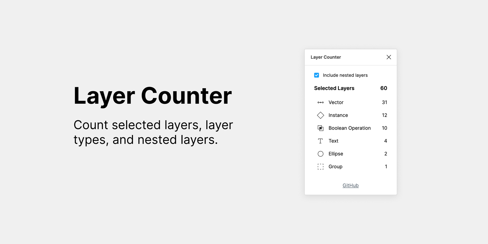

# Layer Counter
Figma Plugin - Count selected layers, layer types, and nested layers.

## Build Instructions
* Run `yarn` to install dependencies.
* Run `yarn build:watch` to start webpack in watch mode.
* Open `Figma` -> `Plugins` -> `Development` -> `New Plugin...` and choose `manifest.json` file from this repo.
